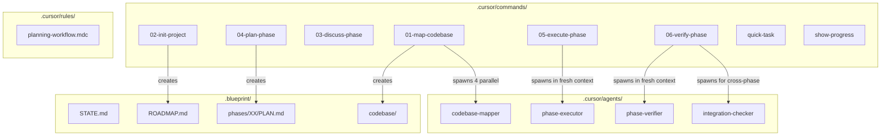

# Blueprint Framework -- Build Plan

## What We're Building

A simplified, Cursor-native planning and execution framework. It takes the best context engineering ideas from GSD and wraps them in a cleaner, document-driven workflow using Cursor's native primitives (commands, subagents, rules). It also works with Claude Code via an installer that handles format conversion.

**Name:** Blueprint  
**Storage:** `.blueprint/` (distinct from GSD's `.planning/`)  
**No conflicts with the original GSD framework -- both can coexist on the same system.**

---

## Design Philosophy

**Guiding principles:**

- **User is the orchestrator, not an automated system** -- the user drives the workflow, commands are tools not autopilot
- **Document-driven state** -- markdown files ARE the system. No databases, no hidden state, no custom tooling
- **Fresh context via subagents** -- replaces the manual "+ New Agent" button click in Cursor. Subagents run in isolated context windows so the parent stays clean
- **No conflict with original GSD** -- `.blueprint/` not `.planning/`, our command/agent names are distinct, different install paths
- **Works with both Cursor and Claude Code** -- installer handles format conversion between runtimes
- **Preserve GSD's formatting and prompt engineering patterns** -- XML-structured prompts, downstream consumer docs, success criteria, anti-patterns

---

## The Three Phases

| Phase | Name | What It Does | Depends On |
|-------|------|-------------|------------|
| 1 | [Foundation](./phase-1-foundation.md) | Scaffold directories, adapt templates, write rule, clean up old GSD files | Nothing |
| 2 | [Commands and Subagents](./phase-2-commands-and-subagents.md) | Write all 8 commands and 4 subagents | Phase 1 |
| 3 | [Installer and Documentation](./phase-3-installer-and-docs.md) | Write multi-runtime installer, rewrite README | Phase 2 |

---

## Formatting Principles (Preserved from GSD)

The original GSD framework's prompt structure is a core part of what makes it effective. All commands and subagents preserve these patterns:

- **XML-structured prompts** -- Commands and agents use XML tags (`<role>`, `<process>`, `<step>`, `<philosophy>`, `<critical_rules>`, `<success_criteria>`, `<templates>`, `<forbidden_files>`, `<anti_patterns>`, `<output>`, `<structured_returns>`) to create clear sections that LLMs parse reliably
- **Downstream consumer documentation** -- Each agent documents who reads its output and how they use it. Critical for multi-step workflows where one agent's output feeds another's input
- **Success criteria checklists** -- Every command and agent ends with `- [ ]` checkboxes that define "done." Verifiable, not vague
- **YAML frontmatter** -- Cursor subagents use YAML frontmatter (`name`, `description`, `model`, `readonly`, `is_background`). Commands use plain markdown with clear section headers
- **Template-driven output** -- Planning documents (ROADMAP.md, REQUIREMENTS.md, etc.) follow strict templates. Agents fill templates rather than inventing structure, ensuring consistency across sessions
- **Prescriptive over descriptive** -- Instructions say "Use X" not "X is used." This matters because agents act on instructions -- prescriptive language produces better results
- **Anti-patterns sections** -- Explicit "what NOT to do" in every command and agent
- **Forbidden files security** -- Never read `.env`, credentials, keys, secrets

## Command Set (8 commands, down from 28)

### Core Workflow

| # | File | Invoked as | Mode | What it does |
|---|------|-----------|------|-------------|
| 1 | `01-map-codebase.md` | `/01-map-codebase` | Agent | Spawn 4 parallel mapper subagents to analyze codebase |
| 2 | `02-init-project.md` | `/02-init-project` | Agent | Questions, requirements, roadmap, progress tracker |
| 3 | `03-discuss-phase.md` | `/03-discuss-phase` | Agent | Capture implementation decisions before planning |
| 4 | `04-plan-phase.md` | `/04-plan-phase` | Agent | Research codebase, create implementation plan for next phase |
| 5 | `05-execute-phase.md` | `/05-execute-phase` | Agent | Spawn executor subagent with plan in fresh context |
| 6 | `06-verify-phase.md` | `/06-verify-phase` | Agent | Spawn verifier + checker subagents to confirm goal achievement |

### Utilities

| # | File | Invoked as | Mode | What it does |
|---|------|-----------|------|-------------|
| 7 | `quick-task.md` | `/quick-task` | Agent | Ad-hoc task with progress tracking |
| 8 | `show-progress.md` | `/show-progress` | Ask | Show current state, what's next, list commands |

### What Was Cut From the Original 28 Commands and Why

- Settings/profiles -- Cursor handles model selection natively
- Pause/resume work -- Cursor has session resume built in
- Add/insert/remove phase -- Direct ROADMAP.md editing is simpler
- Milestone management (complete/new/audit) -- Archiving is manual (user's preference)
- Todo management -- Cursor's TodoWrite tool handles this
- Debug command -- Cursor has Debug Mode built in
- Update/community -- Not applicable to custom fork

## What We're Cutting From GSD (Summary)

- 28 commands down to 8 (6 core workflow + 2 utilities)
- 11 agents down to 4 subagents
- Settings/profiles (Cursor handles model selection)
- Pause/resume (Cursor has session resume)
- Todo management (Cursor's TodoWrite tool)
- Debug command (Cursor has Debug Mode)
- Milestone ceremony (direct ROADMAP.md editing)
- `gsd-tools.js` custom tooling (not needed)
- All `gsd-` naming and branding

## The "+ New Agent" Automation

The button on Cursor plans opens a fresh agent session with the plan pre-loaded. We replicate this with subagents:

1. `/04-plan-phase` creates PLAN.md in `.blueprint/phases/` -- user reviews
2. User runs `/05-execute-phase` -- this spawns a `phase-executor` subagent
3. The subagent gets a purpose-built prompt with the plan content + execution instructions + deviation policy
4. It runs in a fresh context window (exactly like clicking "+ New Agent")
5. Parent stays clean -- only receives the summary when done

This eliminates the manual flow entirely. Same for verification: `/06-verify-phase` spawns `phase-verifier` subagent in fresh context.

---

## Naming Strategy

**Core workflow commands** are numbered in execution order (01-06). Numbers ensure correct sort order in Cursor's command palette and make the intended sequence obvious.

**Utility commands** are unnumbered since they can be run at any time, outside the sequence.

**Subagents** use descriptive names (`codebase-mapper`, `phase-executor`, `phase-verifier`, `integration-checker`) in `.cursor/agents/`. No brand prefix -- the names describe what they do. They live in `.cursor/agents/` which is a different path from GSD's `.claude/agents/gsd-*`, so no conflicts.

**Rules** use descriptive names (`planning-workflow.mdc`) in `.cursor/rules/`.

**Storage** uses `.blueprint/` -- distinct from GSD's `.planning/`, the user's `docs/planner+tracker/`, and Cursor's `.cursor/plans/`.

---

## End-to-End User Workflow

```
/01-map-codebase            # Analyze existing codebase (4 parallel subagents)
/02-init-project            # Ask questions -> REQUIREMENTS -> ROADMAP -> PROGRESS
/03-discuss-phase 1         # Capture decisions for Phase 1 -> CONTEXT.md
/04-plan-phase 1            # Research + create PLAN.md in .blueprint/ -> user reviews
/05-execute-phase 1         # Spawns executor subagent in fresh context
/06-verify-phase 1          # Spawns verifier + checker subagents
/03-discuss-phase 2         # Next phase...
...
```

Each command runs in a dedicated agent session (user's existing habit for clean context). The subagent spawning in `/05-execute-phase` and `/06-verify-phase` replaces the manual "+ New Agent" button click.

## `.blueprint/` Storage Layout (Created Per-Project at Runtime)

All planning artifacts live in `.blueprint/` at the project root. This avoids conflicts with:

- `.planning/` (original GSD for Claude Code)
- `docs/planner+tracker/` (user's personal workflow)
- `.cursor/plans/` (Cursor's native plan storage)

```
.blueprint/
  config.json              # Settings (depth, mode)
  STATE.md                 # Living memory (under 100 lines)
  PROJECT.md               # Project vision and constraints
  REQUIREMENTS.md          # Scoped requirements with IDs
  ROADMAP.md               # Phase structure with success criteria
  PROGRESS.md              # Lightweight checklist (user's pattern)
  codebase/                # Codebase analysis (7 docs)
    STACK.md
    ARCHITECTURE.md
    STRUCTURE.md
    CONVENTIONS.md
    TESTING.md
    INTEGRATIONS.md
    CONCERNS.md
  phases/
    01-name/
      CONTEXT.md           # Implementation decisions from discuss
      PLAN.md              # Implementation plan (YAML frontmatter todos)
      SUMMARY.md           # Execution summary
      VERIFICATION.md      # Verification report
    02-name/
      ...
  archived/
    MM-DD-YY/              # User's archiving convention
```

Key differences from original GSD:

- `PROGRESS.md` is a separate lightweight checklist (user's pattern from planner+tracker)
- Plans use YAML frontmatter todos (user's pattern from execute command)
- Flat file structure where possible (no nested `.planning/phases/XX-name/` prefixes on filenames)
- Archived using date-based folders (user's `MM-DD-YY` convention)

---

## Cursor Primitives Mapping



---

## Directory Structure (After All Phases Complete)

```
project-root/
  .cursor/
    commands/                # 8 command files
      01-map-codebase.md
      02-init-project.md
      03-discuss-phase.md
      04-plan-phase.md
      05-execute-phase.md
      06-verify-phase.md
      quick-task.md
      show-progress.md
    agents/                  # 4 subagent files
      codebase-mapper.md
      phase-executor.md
      phase-verifier.md
      integration-checker.md
    rules/                   # 1 rule file
      planning-workflow.mdc
  templates/                 # Adapted templates
    roadmap.md
    requirements.md
    state.md
    context.md
    project.md
    progress.md
    plan.md
    summary.md
    verification.md
    config.json
    codebase/
      stack.md
      architecture.md
      structure.md
      conventions.md
      testing.md
      integrations.md
      concerns.md
  bin/
    install.js               # Multi-runtime installer
  .blueprint/                # Created per-project at runtime
    ...
```

